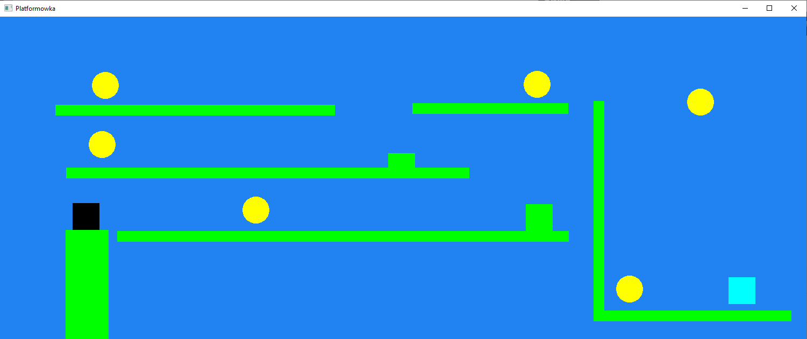
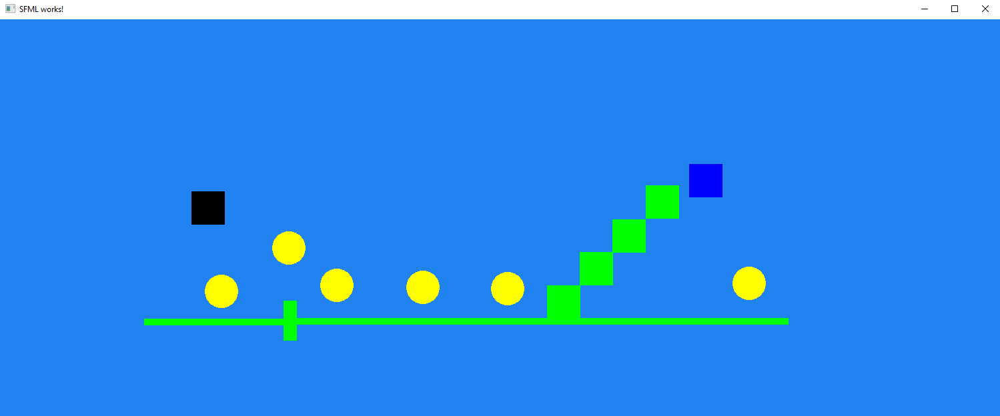

# Platformówka (08.2020)
Prosta platformówka 2D z wieloma poziomami oraz generatorem poziomów. Gra i generator to osobne programy.

## Wymagania funkcjonalne gry:
* Użytkownik porusza się strzałkami w lewo, prawo oraz do góry (czarny kwadrat),
* Grawitacja,
* Przejście między kolejnymi poziomami jest możliwe poprzez kolizję z metą (cyjanowy kwadrat),
* Użytkownik może zbiera momenty (żółte koła),
* Zielone obiekty są jedynymi obiektami z kolizją,
* Spadnięcie poza mapę skutkuje przegraną.

## Wymagania funkcjonalne generatora poziomów:
* Na początku generowany jest obiekt gracza,
* Przemieszczenie obiektu jest możliwe poprzez klinięcie na niego i później potwtórne kliknięcie w innym miejscu,
* Dodawanie obiektów poprzez klawisze:
    * B - kolidujące (meta jest pierwszym obiektem tego typu),
    * C - monety.
* Zwiększanie/Zmniejszanie X obiektów poprzez strzałkę w prawo/lewo,
* Zwiększanie/Zmniejszanie Y obiektów poprzez strzałkę w górę/dół,
* Usuwanie obiektów poprzez klawisz D,
* Resetowanie poprzez klawisz R,
* Zapisanie nowego poziomu poprzez klawisz S.

## Technologie:
* Główny język - C++,
* GUI - SFML (biblioteka graficzna języka C++).

## Zrzuty ekranu:

Przykładowy poziom:

    

Przykładowy poziom w generatorze poziomów:

    

